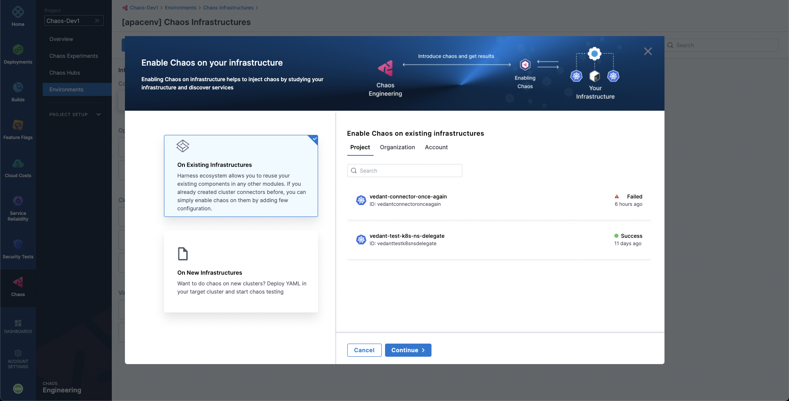

Chaos delegate is a service that runs in your infrastructure and aids HCE in accessing and injecting chaos at cloud-native scale. There are different types of delegates based on the target infrastructure, such as Kubernetes, Linux VMs, AWS cloud, VMware, etc. Therefore, these delegates might install as a Kubernetes service or a Linux daemon and so on, based on their type. All the delegates adhere to the principle of least privilege where the delegate executes only with the minimum levels of permissions needed.

## Create Environment
To add a Chaos Delegate for your infrastructure, first we need to create a new environment as part of which the chaos infrastructures will exist. Head to the **Environments** page, which lists all the environments added as part of your project. Choose **New Environment**.

In the **Create a new environment** modal, provide a name for the environment, optionally you can also add a description and tags. Then select an environment type i.e. **Production** or **Non-Production**. Then select **Create**. This will instantly create a new environment.

## Add Chaos Infrastructure
Now we can add an infrastructure to our environment. Select **New Chaos Infrastructure**. 

You can either setup a chaos delegate on an existing infrastructures that use a Harness cluster connector i.e. Harness Kubernetes delegate or install the chaos delegate in a new infrastructure.

To use an existing Harness Kubernetes delegate to install your chaos infrastructure, select **On Existing Infrastructures** in the modal. You can use any delegate under the Project, Organization, and Account scope.

:::info
1. A Harness Kubernetes delegate with cluster-wide read/write access can setup both cluster-scoped and namespaced-scoped chaos delegates.
2. A Harness Kubernetes delegate with cluster-wide read access **can't** be used to setup a chaos delegate.
3. A Harness Kubernetes delegate with specific namespace access can only be used to setup a namespace-scoped chaos delegate in that specific namespace.
:::

To install chaos delegate on a new infrastructure, select **On New Infrastructures**. Then, select **Continue**.
Provide a name for the infrastructure. Optionally, you can also provide a description and tags. Then, select **Next**. 

Under the installation mode, choose either **Cluster Wide** or **Namespace Mode** for installing the chaos delegate. By default the delegate uses `litmus` namespace and `litmus` service account, which can be configured under the K8s Cluster Details. Optionally, you can also specify node selectors and K8s tolerations for chaos infrastructure deployment.

Then, select **Next**. In the final step, if you're deploying to an existing infrastructure with Harness Kubernetes Delegate, then Harness will install the chaos delegate on your behalf. Otherwise, if you're setting up the delegate on a new infrastructure, then you will need to execute the given commands and/or download and apply the delegate manifest.

Finally, select **Done**.

## Validating Chaos Delegate Installation
Upon applying the manifest, it will take a while to setup all the chaos delegate resources. After a while, the chaos infrastructure's connection state should reflect as `CONNECTED`.

If the chaos infrastructure remains in a `NOT CONNECTED` state, follow the suggestions on the **Troubleshooting** tab to resolve it.

That's it! Now you're ready to inject chaos into your infrastructure.
