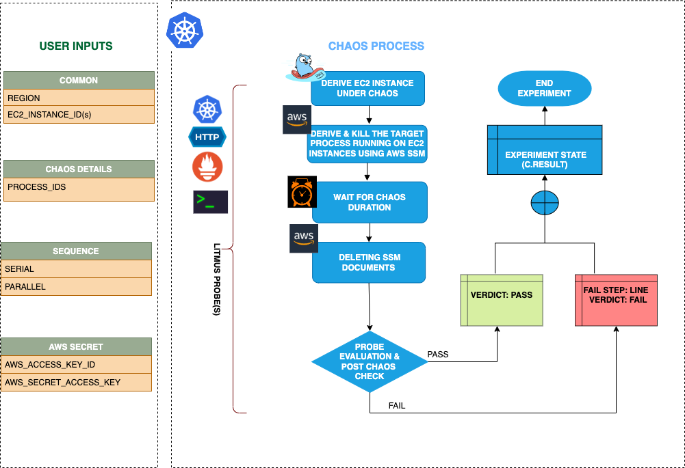

## Introduction

- EC2 Process Kill experiment kills the target processes running on ec2 instance to determine the application/process resilience.
- It helps to check the performance of the application/process running on the ec2 instance(s).

:::tip Fault execution flow chart

:::

## Uses

<details>
<summary>View the uses of the experiment</summary>
<div>
Disrupt the application critical processes such as databases or message queues running in the ec2 instance by killing their underlying processes or threads.
</div>
</details>

## Prerequisites

:::info

- Ensure that Kubernetes Version > 1.16

**AWS EC2 Access Requirement:**

- Ensure that SSM agent is installed and running in the target EC2 instance.
- Ensure to create a Kubernetes secret having the AWS Access Key ID and Secret Access Key credentials in the `CHAOS_NAMESPACE`. A sample secret file looks like:

```yaml
apiVersion: v1
kind: Secret
metadata:
  name: cloud-secret
type: Opaque
stringData:
  cloud_config.yml: |-
    # Add the cloud AWS credentials respectively
    [default]
    aws_access_key_id = XXXXXXXXXXXXXXXXXXX
    aws_secret_access_key = XXXXXXXXXXXXXXXXXXXXXXXXXXXXXXXXXXXX
```

- If you change the secret name then please also update the `experiment.yml` ENV values for deriving the respective data from the secret. Also account for the path at which this secret is mounted as a file in the manifest ENV `AWS_SHARED_CREDENTIALS_FILE`.

### NOTE

You can pass the VM credentials as secrets or as an ChaosEngine ENV variable.
:::

## Default Validations

:::info

- EC2 instance should be in healthy state
- The target processes should exist in the VM.

:::

## Experiment Tunables

<details>
    <summary>Check the Experiment Tunables</summary>
    <h2>Mandatory Fields</h2>
    <table>
      <tr>
        <th> Variables </th>
        <th> Description </th>
        <th> Notes </th>
      </tr>
      <tr>
        <td> EC2_INSTANCE_ID </td>
        <td> ID of the target EC2 instance </td>
        <td> For example: <code>i-044d3cb4b03b8af1f</code> </td>
      </tr>
      <tr>
        <td> REGION </td>
        <td> The AWS region ID where the EC2 instance has been created </td>
        <td> For example: <code>us-east-1</code> </td>
      </tr>
      <tr>
        <td> PROCESS_IDS </td>
        <td> Process IDs of the target processes provided as comma separated values </td>
        <td> 183,253,857 </td>
      </tr>
    </table>
    <h2>Optional Fields</h2>
    <table>
      <tr>
        <th> Variables </th>
        <th> Description </th>
        <th> Notes </th>
      </tr>
      <tr>
        <td> TOTAL_CHAOS_DURATION </td>
        <td> The total time duration for chaos insertion (sec) </td>
        <td> Defaults to 30s </td>
      </tr>
      <tr>
        <td> RAMP_TIME </td>
        <td> Period to wait before and after injection of chaos in sec </td>
        <td> </td>
      </tr>
    </table>
</details>

## Experiment Examples

### Common Experiment Tunables

Refer to the [common attributes](../common-tunables-for-all-experiments) to tune the common tunables for all the experiments.

### PROCESS_IDS

It contains the target process Ids running on a particular ec2 instance

Use the following example to tune this:

[embedmd]:# (./static/manifests/ec2-process-kill/ec2-process-kill-processid.yaml yaml)
```yaml
# Process kill running on ec2 instance
apiVersion: litmuschaos.io/v1alpha1
kind: ChaosEngine
metadata:
  name: engine-nginx
spec:
  engineState: "active"
  chaosServiceAccount: litmus-admin
  experiments:
  - name: ec2-process-kill
    spec:
      components:
        env:
        # List of Process IDs
        - name: PROCESS_IDS
          value: '8688,4678'
        - name: EC2_INSTANCE_ID
          value: 'instance-1'
        - name: REGION
          value: 'us-west-2'
```
